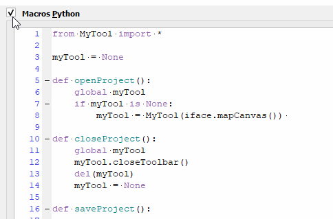
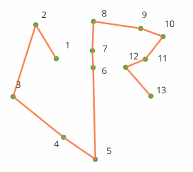
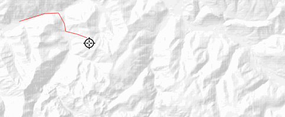
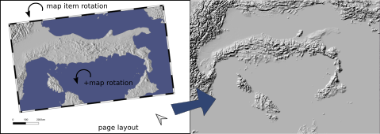
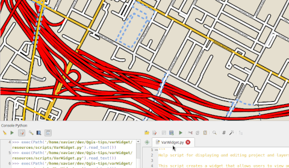

# Qgis-tips

[english version](README.md) - [cette page sur github.io](https://xcaeag.github.io/Qgis-tips/)

[Les macros de projet](#les-macros-de-projet-pour-une-barre-doutils-dédiée-au-projet)\
[Courbes de Bezier - expression](#fonction-expressions-styles-pour-construire-des-courbes-de-bezier)\
[Profil d'altitude - style](#expressions--style-pour-profil-daltitude)\
[Traveling](#script-pour-un-travelling)\
[Preparer MNT pour blender](#préparer-un-mnt-pour-blender-bien-ajusté-à-une-mise-en-page)\
[Couches virtuelles](#les-couches-virtuelles-pour-planter-des-arbres)\
[Dock pour ajuster les variables](#un-dock-pour-ajuster-les-variables)

## Les macros de projet pour une barre d'outils dédiée au projet

L'idée : pour ne pas se lancer dans l'écriture (un peu lourde) d'un plugin, et proposer une barre d'outils propre à un projet, on utilise les "macros".  
Plus de détails ici : [Macros](macros/LISEZMOI.md)

## Fonction, expressions, styles pour construire des courbes de Bezier

L'idée : proposer une expression pour dessiner une courbe de Bezier dynamiquement à partir de points de contrôles portés par une 'linestring'.

Les détails ici : [Bezier](bezier/LISEZMOI.md)

## Expressions + style pour profil d'altitude

L'idée : proposer une expression pour dessiner un profil altitudinal dynamiquement.

Les détails ici : [Profil](profil/LISEZMOI.md)

## Script pour un travelling

En s'appuyant sur le controleur temporel, l'idée est de suivre un trajet de 'caméra' défini par une géométrie de type linestring. 

Les détails ici : [Travelling](travelling/LISEZMOI.md)

## Préparer un MNT pour Blender, bien ajusté à une mise en page

Ou comment découper, pivoter un raster selon l'emprise d'une mise en page, extrapolant l'étendue du MNT à la page entière, en tenant compte des rotations.

par ici : [layout](layout/LISEZMOI.md)

## Les couches virtuelles... pour planter des arbres

Couche virtuelle - récursivité - ou comment remplacer le générateur de géométrie par un bout de code SQL.

un peu plus ici : [forest](forest/LISEZMOI.md)

## Un dock pour ajuster les variables

Explications : [Var Widget](varWidget/LISEZMOI.md)