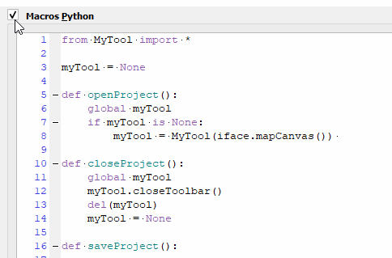
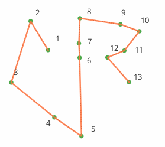
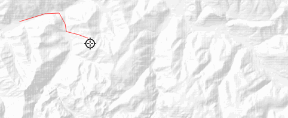
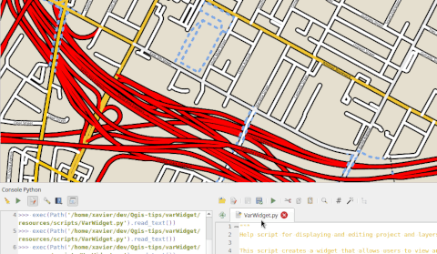

# Qgis-tips

[french version](LISEZMOI.md) - [this page on github.io](https://xcaeag.github.io/Qgis-tips/)

[DEM raster retouch](#dem-raster-retouch)\
[Typograph - labelling](#typograph)\
[Project macros](#project-macros-for-specific-toolbar)\
[Bezier curves style](#function-expressions-styles-to-construct-bezier-curves)\
[Altitude profile style](#expressions--style-for-altitude-profile)\
[Tracking shot script](#script-for-a-tracking-shot)\
[Virtual layers](#virtual-layers-for-planting-trees)\
[A dock for adjusting variables](#a-dock-for-adjusting-variables)

## DEM raster retouch

[A toolbar](rasterRetouch/README.md) to edit a DEM using the brush tool.

## Typograph

Enforce labelling, animate it !

Explanations : [Typograph](typograph/README.md)

## Project Macros for specific toolbar

To avoid having to write a plugin (a bit complex), and to offer a toolbar specific to a project, we use "macros".  
Some details here : [Macros](macros/README.md)

## Function, expressions, styles to construct Bezier curves

The idea: propose an expression to draw a Bezier curve dynamically from control points carried by a 'linestring'.

Details here: [Bezier](bezier/README.md)

## Expressions + style for altitude profile

The idea: propose an expression to dynamically draw an altitudinal profile.

Details here : [Profil](profil/README.md)

## Script for a tracking shot

Using the temporal controller, the idea is to follow a 'camera' path defined by a linestring geometry.

Details here: [Travelling](travelling/README.md)

## Virtual layers... for planting trees

Virtual layer - recursion - or how to replace the geometry generator with a piece of SQL code.

a little more here : [forest](forest/README.md)

## A dock for adjusting variables

Explanations : [Var Widget](varWidget/README.md)

