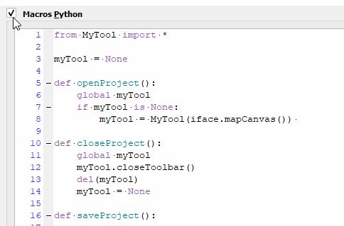

# Qgis-tips

[french version](LISEZMOI.md)

## Project Macros for specific toolbar

To avoid having to write a plugin (a bit complex), and to offer a toolbar specific to a project, we use "macros".  Some details here : [Macros](macros/README.md)

