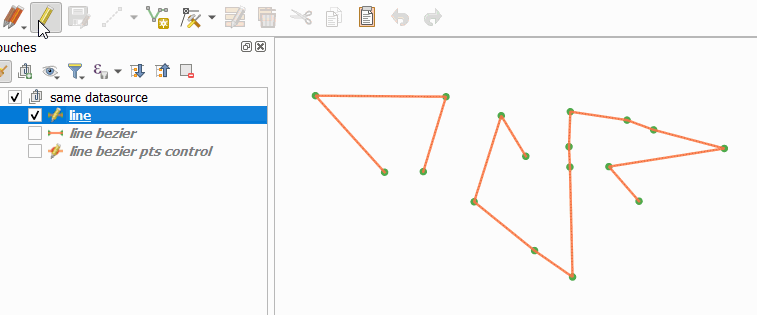
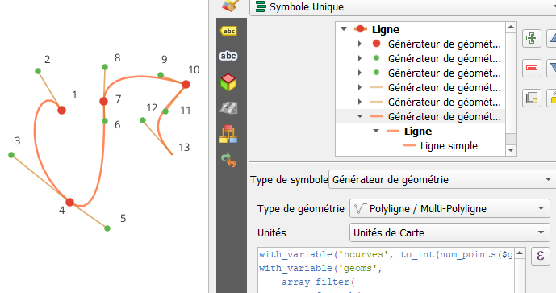
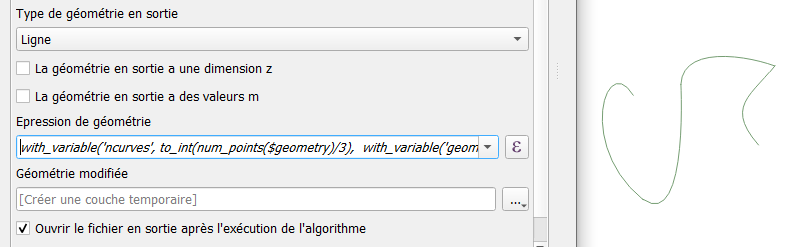

## Fonction, expressions, styles pour construire des courbes de Bezier

[english version](README.md)

L'idée : proposer une expression pour dessiner une courbe de Bezier dynamiquement à partir de points de contrôles (portés par une géométrie de type linestring).

L'expression peut être utilisée par le traitement "Géométrie par expression" pour produire aussi une nouvelle géométrie.

A quoi ça sert ? Jouer avec les expressions, et dans mon cas : produire une courbe pour un mouvement de 'caméra' souple, pour l'export d'un gif animé.



## Les fonctions

Code à placer dans un nouveau fichier de fonctions, dans l'éditeur de fonction de la fenêtre de construction des expressions.

Les algos ont été trouvés là, je n'ai rien inventé : [https://codereview.stackexchange.com/questions/240710/pure-python-b%C3%A9zier-curve-implementation](https://codereview.stackexchange.com/questions/240710/pure-python-b%C3%A9zier-curve-implementation)

C'est la fonction `bezierFromLine` qui sera utilisée dans nos expressions. ([resources/bezier.py](resources/bezier.py))

```python
from qgis.utils import qgsfunction
from qgis.core import QgsPointXY, QgsGeometry
import math
import numpy as np


def bezierPoint(ctrlPoints, t):
    while len(ctrlPoints) > 1:
        controlLinestring = zip(ctrlPoints[:-1], ctrlPoints[1:])
        ctrlPoints = [(1 - t) * p1 + t * p2 for p1, p2 in controlLinestring]
    return ctrlPoints[0]

def bezierCurve(ctrlPoints, npoints):
    last_point = npoints - 1
    return [bezierPoint(ctrlPoints, i / last_point) for i in range(npoints)]

@qgsfunction(args="auto", group="Custom")
def bezierFromLine(lineGeom, npoints, feature, parent):
    ctrlpoints = [np.array([p.x(), p.y()]) for p in lineGeom.asPolyline()]
    newPoints = bezierCurve(ctrlpoints, npoints)
    polyLine = [QgsPointXY(p[0], p[1]) for p in newPoints]
    newG = QgsGeometry.fromPolylineXY(polyLine)
    return newG
```

## Les expressions

Une première toute simple, utilisée dans un style avec générateur de géométrie (ligne) transforme la ligne brisée en courbe de Bezier, en utilisant chaque noeud comme point de contrôle. Style 'A' à récupérer dans le dépôt github.

```sql
-- Expression de générateur de géométrie linestring
bezierFromLine(
    $geometry, 
    -- nb de points dans la courbe finale proportionnelle aux nb de points de la ligne originale
    num_points($geometry)*5 
)
```


La deuxième, un peu plus complexe, combine les courbes correspondantes à 4 points de contrôles successifs. Ainsi, le premier et le dernier point du quadruplet sont les passages obligés (accroches). Les courbes successives sont connectées par le dernier point d'un quadruplet et le premier de la courbe suivante, identiques.

Le nombre de points nécessaire : 3*n+1  soit 4, 7, 10... les superflus sont ignorés.

Permet ainsi de dessiner à la façon des outils de dessin vectoriel, en maîtrisant la position des 'poignées' que sont les noeuds de notre linestring.

Le style 'B' (sous github) met en évidence ces 'poignées', ainsi que les segments les reliants aux points d'accroche.

```sql
-- Expression de générateur de géométrie linestring

-- nb de points dans la ligne originale
with_variable('ncurves', to_int(num_points($geometry)/3), 
-- tableau de geométries (une courbe tous les 3 noeuds)
with_variable('geoms', 
    -- exclure les geom nulles du tableau
	array_filter(
        -- un tableau de courbes, une par quadruplet
        array_foreach(
            generate_series(1, @ncurves),
            -- ne produire une courbe que si le nb de points est suffisant
            case when 4+3*(@element-1) <=  num_points( $geometry)
            then bezierFromLine( -- courbe de bezier sur quadruplet
                make_line(array(
                    point_n($geometry, 1+3*(@element-1)),
                    point_n($geometry, 2+3*(@element-1)),
                    point_n($geometry, 3+3*(@element-1)),
                    point_n($geometry, 4+3*(@element-1))
                ))
                , 15  -- nb de points par courbe
            )
            else NULL end
        ), @element is not null
    ),
    -- produire multilinestring à partir du tableau de linestring
	collect_geometries(@geoms)
))

```



## Sauver la géométrie calculée

Tout simplement à l'aide de l'outil `Géométrie par expression` de la boîte à outils de traitements !

Placer une des deux expressions à la place de `$geometry` dans le champ adéquat, préciser le type 'ligne'... et hop.



## Les fichiers

- repo : [https://github.com/xcaeag/Qgis-tips](https://github.com/xcaeag/Qgis-tips)
- Les fonctions : [resources/bezier.py](resources/bezier.py)
- style A : [resources/styleA.qml](resources/styleA.qml)
- style B : [resources/styleB.qml](resources/styleB.qml)
