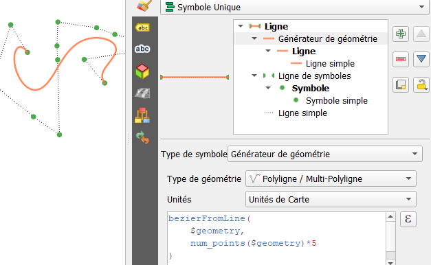

## Function, expressions, styles to construct Bezier curves

[french version](LISEZMOI.md) - [top](../README.md)

The idea: propose an expression to draw a Bezier curve dynamically from control points (carried by a linestring geometry).

The expression can be used by the "Geometry by expression" processing tool to also produce new layer.

What's the point ? Playing with expressions, and in my case: producing a curve for a flexible 'camera' movement, for exporting an animated gif.


## Functions

Code to place in a new functions file, in the function editor of the expression construction window.

The algorithms were found there, I didn't invent anything: [https://codereview.stackexchange.com/questions/240710/pure-python-b%C3%A9zier-curve-implementation](https://codereview.stackexchange.com/questions/240710/pure-python-b%C3%A9zier-curve-implementation)

It is the `bezierFromLine` function which will be used in our expressions. ([resources/bezier.py](resources/bezier.py))

```python
from qgis.utils import qgsfunction
from qgis.core import QgsPoint, QgsGeometry
import math
import numpy as np


def bezierPoint(ctrlPoints, t):
    while len(ctrlPoints) > 1:
        controlLinestring = zip(ctrlPoints[:-1], ctrlPoints[1:])
        ctrlPoints = [(1 - t) * p1 + t * p2 for p1, p2 in controlLinestring]
    return ctrlPoints[0]

def bezierCurve(ctrlPoints, npoints):
    last_point = npoints - 1
    return [bezierPoint(ctrlPoints, i / last_point) for i in range(npoints)]

@qgsfunction(args="auto", group="Custom")
def bezierFromLine(lineGeom, npoints, feature, parent):
    ctrlpoints = [np.array([p.x(), p.y(), p.z(), p.m()]) for p in lineGeom.vertices()]
    newPoints = bezierCurve(ctrlpoints, npoints)
    polyLine = [QgsPoint(p[0], p[1], p[2], p[3]) for p in newPoints]
    newG = QgsGeometry.fromPolyline(polyLine)
    return newG
```

## Expressions

A very simple first, used in a style with geometry generator (line) transforms the broken line into a Bezier curve, using each node as a control point. You will find Style 'A' in the github repository.

```sql
-- Linestring geometry generator expression
bezierFromLine(
    $geometry, 
    -- number of points in the final curve proportional to the number of points in the original line
    num_points($geometry)*5 
)
```



The second, a little more complex, combines the curves corresponding to 4 successive control points. Thus, the first and last point of the quadruplet are the obligatory passages (hooks). The successive curves are connected by the last point of a quadruplet and the first of the next curve, identical.

The number of points required: 3*n+1  (4, 7, 10...) the unnecessary ones are ignored.

Allows you to draw like vector drawing tools, by controlling the position of the 'handles' which are the nodes of our linestring.

Style 'B' (see github) shows these 'handles', as well as the segments connecting them to the hook points.

```pgsql
-- Linestring geometry generator expression

-- number of points in the original line
with_variable('ncurves', to_int(num_points($geometry)/3), 
-- geometry array (a curve every 3 nodes)
with_variable('geoms', 
    -- exclude null geoms from array
	array_filter(
        -- an array of curves, one per quadruplet
        array_foreach(
            generate_series(1, @ncurves),
            -- produce curve only if the number of points is sufficient
            case when 4+3*(@element-1) <=  num_points( $geometry)
            then bezierFromLine( -- courbe de bezier sur quadruplet
                make_line(array(
                    point_n($geometry, 1+3*(@element-1)),
                    point_n($geometry, 2+3*(@element-1)),
                    point_n($geometry, 3+3*(@element-1)),
                    point_n($geometry, 4+3*(@element-1))
                ))
                , 15  -- nb de points par courbe
            )
            else NULL end
        ), @element is not null
    ),
    -- produce multilinestring from linestring array
	collect_geometries(@geoms)
))

```


## Save calculated geometry

Quite simply using the `Geometry by expression` tool from the processing toolbox!

Place one of the two expressions in place of `$geometry` in the appropriate field, specify the 'line' type... .


## Files

- repo : [https://github.com/xcaeag/Qgis-tips](https://github.com/xcaeag/Qgis-tips)
- Functions : [resources/bezier.py](resources/bezier.py)
- style A : [resources/styleA.qml](resources/styleA.qml)
- style B : [resources/styleB.qml](resources/styleB.qml)
