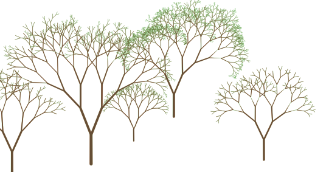

## Couches virtuelles
Ou comment planter des arbres.

[english version](README.md) - [sommaire](../LISEZMOI.md)

Dans QGis, une couche virtuelle est le résultat d'une requête qui exploite (ou pas !) les couches vecteur présentes dans votre projet, à l'aide d'un moteur SpatiaLite (et donc syntaxe Spatialite).

Tout se passe avec le "db-manager" 

cf. https://docs.qgis.org/3.40/fr/docs/user_manual/managing_data_source/create_layers.html#creating-virtual-layers

Les perfs ne seront pas toujours au rendez-vous, mais il est possible de construire des requêtes spatiales assez complexes, et de réellement dépanner si on ne dispose pas d'un bon Postgres.

Cette requête récursive construit un arbre fractal (souvenez-vous de vos débuts en logo !), qui pousse sur Saint-Laurent des arbres (!). 

Vous remarquerez qu'elle n'exploite aucune couche, la première branche est codée 'en dur' : un positionnement, une longueur (400m) qui décroît d'un facteur 0.8 à chaque étage, un angle de pi/10 à gauche et à droite par rapport à la branche précédente...

```sql
-- arbre simple, non paramétré

-- root EPSG:2154 (834783, 6329867)
WITH RECURSIVE branch(azimuth, x0, y0, x, y, len, n) AS (
	-- first branch
    VALUES (
		pi()/2,                -- azimuth = first orientation
		834783, 6329867,       -- x0, y0 = first point (bottom)
		834783, (6329867+400), -- x, y = second point (top)
		400,                   -- len = branch length
		1                      -- n = level
	)
UNION ALL
	-- other branches
    select azimuth+side*pi()/10,               -- next azimuths (left and right) angle = pi/10
    	x as x0, y as y0,                      -- next seed
    	(x+cos(azimuth+side*pi()/10)*len),     -- next branch extremity
    	(y+sin(azimuth+side*pi()/10)*len),  
    	(len*0.8) as len,                      -- next length
    	(n+1) as n                             -- next level
    FROM branch
	-- two sides
    cross join (select -1 as side union select 1 as side) sides
	-- stop
    WHERE n < 8
)
select setsrid(st_collect(makeline(makepoint(x0, y0), makepoint(x, y))), 2154) as tree 
from branch
```


Pour la syntaxe de la récursivité, je vous laisse lire la doc Postgres : https://docs.postgresql.fr/10/queries-with.html

Le principe est de partir d'une 'graine' (la première partie de la requête ci-dessous : le 'VALUES (1)'), puis d'itérer sur le terme récursif qui fait référence au résultat de la requête elle-même.

```sql
WITH RECURSIVE t(n) AS (
    VALUES (1)
  UNION ALL
    SELECT n+1 FROM t WHERE n < 100
)
SELECT sum(n) FROM t;
```

Petit ajout pour un arbre : la récursion est scindée en deux branches à chaque niveau (le CROSS JOIN (-1, 1)).

### Un peu plus réaliste



En un peu plus complexe pour rendre la construction paramétrée : 

- la première branche (le tronc) est construite à partir de données portées par une couche de points (vous pouvez créer votre couche ou utiliser celle-ci : [gpkg](resources/fractal.gpkg)).
- la géométrie (point) sera la position de l'arbre 
- des intervalles de valeurs et de l'aléatoire pour une forme plus 'naturelle'
- l'utilisation de la valeur 'm' des noeuds pour un rendu qui fait varier l'épaisseur des branches.

Une couche (nommée 'root') du projet ([qgz](resources/forest.qgz)) n'est là que pour les positions initiales et les paramètres, 

La couche virtuelle (la requête suivante) affiche les arbres (un par enregistrement dans la table 'root').

Les champs utilisés : 
- len : longueur de la première branche (le tronc)
- aperture_min, aperture_max : intervalle de l'angle que fait la branche avec la précédente.
- len_fmin, len_fmax : intervalle du facteur de réduction de la longueur
- leef_min, leef_max : nombre de niveau mini, maxi

Le `SELECT` final construit une géométrie. En le simplifiant : `collect(makeline(makepoint(x0, y0), makepoint(x, y)))`, c'est à dire une multi-ligne des segments correspondants à chaque branche.

Le remplacer par `SELECT x0, y0, x, y` pour obtenir l'ensemble des noeuds.

En plus : les vertex de notre géométrie contiennent les valeurs 'M' qui seront utilisées pour rendre une 'épaisseur' (`makepointm` plutôt que `makepoint`), et le système de coordonnées est précisé. 

**La requête :**
```sql
WITH RECURSIVE nodes(azimuth, x0, y0, x, y, len, aperture_min, aperture_max, len_fmin, len_fmax, leef_min, leef_max, n) AS (
	-- 
    select pi()/2, x(geometry), y(geometry), x(geometry), y(geometry)+len, len, aperture_min, aperture_max, len_fmin, len_fmax, leef_min, leef_max, 1 
    from root /*le nom de la couche de points*/
    
	UNION all
	
  	select azimuth+side*(aperture_min+rand*(aperture_max-aperture_min)), 
	   	x as x0, y as y0, 
  		(x+cos(azimuth+side*(aperture_min+rand*(aperture_max-aperture_min)))*len), 
  		(y+sin(azimuth+side*(aperture_min+rand*(aperture_max-aperture_min)))*len), 
    	(len*(len_fmin+rand*(len_fmax-len_fmin))) as len, 
    	aperture_min, aperture_max, len_fmin, len_fmax, leef_min, leef_max,
    	n+1 as n
  	from nodes
  	join (select (abs(random() % 1000)/1000) as rand) r on true
    cross join (select -1 as side union select 1 as side) sides
    WHERE n < (leef_min+(abs(random() % 1000)/1000)*(leef_max-leef_min))
),
branches as (
	select len, x0, y0, x, y, n, 
		to_real(((max(n) over ())-n+1))/(max(n) over ()) as w1,
		to_real(((max(n) over ())-n))/(max(n) over ()) as w2
	from nodes
)
-- SELECT x0, y0, x, y
select setsrid(collect(makeline(makepointm(x0, y0, 1.0+(len/10)*w1), makepointm(x, y, 1.0+(len/10)*w2))), 2154) tree 
from branches
```

Le style : un générateur de géométrie de type polygone, qui construit un buffer dont la distance à la ligne varie selon la valeur 'M' portée par les noeuds de la géométrie.

```python
buffer_by_m($geometry)
```

La couche 'root' basculée en mode 'édition', combinée avec des valeurs par défaut appliquées aux différents champs, la plantation devient rapide !


## Les fichiers

sous /resources

- [projet QGis](resources/forest.qgz)
- [la couche 'root'](resources/fractal.gpkg)
- [le fichier de définition de couche 'root'](resources/fractal-root.qlr)
- [le fichier de définition de couche 'forest'](resources/fractal-forest.qlr)