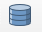

## Virtual layers
Or how to plant trees.

[french version](LISEZMOI.md) - [top](../README.md)

In QGis, a virtual layer is the result of a query that exploits (or not!) the vector layers present in your project, using a SpatiaLite engine (and therefore Spatialite syntax).

It's all done with the db-manager 

cf. https://docs.qgis.org/3.40/en/docs/user_manual/managing_data_source/create_layers.html#creating-virtual-layers

The performance won't always be there, but it is possible to build fairly complex spatial queries, and to really help out if you don't have a good Postgres.

This recursive query builds a fractal tree (remember your early days in logo !), which grows on Saint-Laurent trees (!). 

The first branch is hard-coded: a position, a length (400m) which decreases by a factor of 0.8 at each level, an angle of pi/10 to the left and right in relation to the previous branch...

```sql
-- simple tree, no parameters
-- racine en EPSG:2154 (834783, 6329867)
WITH RECURSIVE branch(azimuth, x0, y0, x, y, len, n) AS (
	-- first branch
    VALUES (
		pi()/2,                -- azimuth = first orientation
		834783, 6329867,       -- x0, y0 = first point (bottom)
		834783, (6329867+400), -- x, y = second point (top)
		400,                   -- len = branch length
		1                      -- n = level
	)
UNION ALL
	-- other branches
    select azimuth+side*pi()/10,               -- next azimuths (left and right) angle = pi/10
    	x as x0, y as y0,                      -- next seed
    	(x+cos(azimuth+side*pi()/10)*len),     -- next branch extremity
    	(y+sin(azimuth+side*pi()/10)*len),  
    	(len*0.8) as len,                      -- next length
    	(n+1) as n                             -- next level
    FROM branch
	-- two sides
    cross join (select -1 as side union select 1 as side) sides
	-- stop
    WHERE n < 8
)
select setsrid(st_collect(makeline(makepoint(x0, y0), makepoint(x, y))), 2154) as tree 
from branch
```


For the syntax of recursion, please read the Postgres doc: https://www.postgresql.org/docs/10/queries-with.html

The principle is to start with a ‘seed’ (the first part of the query below: the ‘VALUES (1)’), then iterate on the recursive term that refers to the result of the query itself.

```sql
WITH RECURSIVE t(n) AS (
    VALUES (1)
  UNION ALL
    SELECT n+1 FROM t WHERE n < 100
)
SELECT sum(n) FROM t;
```

A little addition for a tree: the recursion is split into two branches at each level (the CROSS JOIN (-1, 1)).

### A little more realistic


A little more complex to make the construction parameterised: 

- the first branch (the trunk) is built from data carried by a layer of points (you can create your own layer or use this one: [gpkg](resources/fractal.gpkg)).
- the geometry (point) will be the position of the tree 
- value ranges and randomness for a more ‘natural’ shape
- use of the ‘m’ value of the nodes for a rendering that varies the thickness of the branches.

A layer (named ‘root’) of the project ([qgz](resources/forest.qgz)) is there only for the initial positions and the parameters, 

The virtual layer (the next request) displays the trees (one per record in the ‘root’ table).

The fields used : 
- len: length of the first branch (the trunk)
- aperture_min, aperture_max: range of the angle between the branch and the previous branch.
- len_fmin, len_fmax: interval of the length reduction factor
- leef_min, leef_max: number of minimum and maximum levels.

The final `SELECT` constructs a geometry. To simplify: `collect(makeline(makepoint(x0, y0), makepoint(x, y)))`, i.e. a multi-line of the segments corresponding to each branch.

Replace it with `SELECT x0, y0, x, y` to get all the nodes.

Plus: the vertices in our geometry contain the ‘M’ values which will be used to render a ‘thickness’ (`makepointm` rather than `makepoint`), and the coordinate system is specified. 

**The request :**
```sql
WITH RECURSIVE nodes(azimuth, x0, y0, x, y, len, aperture_min, aperture_max, len_fmin, len_fmax, leef_min, leef_max, n) AS (
	-- 
    select pi()/2, x(geometry), y(geometry), x(geometry), y(geometry)+len, len, aperture_min, aperture_max, len_fmin, len_fmax, leef_min, leef_max, 1 
    from root /*the name of the point layer*/
    
	UNION all
	
  	select azimuth+side*(aperture_min+rand*(aperture_max-aperture_min)), 
	   	x as x0, y as y0, 
  		(x+cos(azimuth+side*(aperture_min+rand*(aperture_max-aperture_min)))*len), 
  		(y+sin(azimuth+side*(aperture_min+rand*(aperture_max-aperture_min)))*len), 
    	(len*(len_fmin+rand*(len_fmax-len_fmin))) as len, 
    	aperture_min, aperture_max, len_fmin, len_fmax, leef_min, leef_max,
    	n+1 as n
  	from nodes
  	join (select (abs(random() % 1000)/1000) as rand) r on true
    cross join (select -1 as side union select 1 as side) sides
    WHERE n < (leef_min+(abs(random() % 1000)/1000)*(leef_max-leef_min))
),
branches as (
	select len, x0, y0, x, y, n, 
		to_real(((max(n) over ())-n+1))/(max(n) over ()) as w1,
		to_real(((max(n) over ())-n))/(max(n) over ()) as w2
	from nodes
)
-- SELECT x0, y0, x, y
select setsrid(collect(makeline(makepointm(x0, y0, 1.0+(len/10)*w1), makepointm(x, y, 1.0+(len/10)*w2))), 2154) tree 
from branches
```

Style: a polygon-type geometry generator, which constructs a buffer whose distance from the line varies according to the ‘M’ value carried by the nodes in the geometry.

```python
buffer_by_m($geometry)
```

With the ‘root’ layer switched to ‘edit’ mode, combined with default values applied to the various fields, planting becomes a snap!


## The files

under /resources

- [QGis project](resources/forest.qgz)
- [the 'root' layer](resources/fractal.gpkg)
- [the layer definition file 'root'](resources/fractal-root.qlr)
- [the layer definition file 'forest'](resources/fractal-forest.qlr)