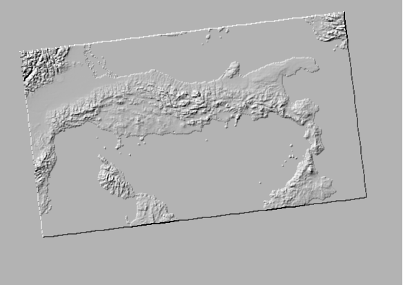

## Préparer un MNT pour Blender, bien calé sur une mise en page

[english version](README.md)

Ou comment découper, pivoter un raster selon l'emprise d'une mise en page,
en extrapolant l'étendue de la carte à la page entière (au delà de l'emprise de l'objet 'map'), 
en tenant compte des rotations !

Permet d'obtenir, par exemple, un MNT de même proportion qu'un export de la même mise en page, bien ajusté, pour Blender.

Sous blender, la juxtaposition de l'image carte sur le MNT est alors facilité.

Concernant l'utilisation du couple QGis/Blender, allez lire l'excellent article de Thomas Szczurek-Gayant là : https://geotribu.fr/articles/2024/2024-05-28_carte-relief-ombre-avec-blender-partie-1-preparation-donnes-avec-qgis-et-gdal/

**La mise en page** dont on souhaite produire une carte en 3D sous blender.


**Le MNT produit**


**ou une version 'emboutie' au niveau de la mer et aux bordures de la carte**



## Le code

Tout est là, un peu commenté, à jouer dans la console Python : [resources/script.py](resources/script.py)

En fin de script, les bouts de codes à décommenter.

La librairie skimage est nécessaire (https://scikit-image.org/docs/stable/user_guide/install.html)

```bash
python -m pip install -U scikit-image
```
