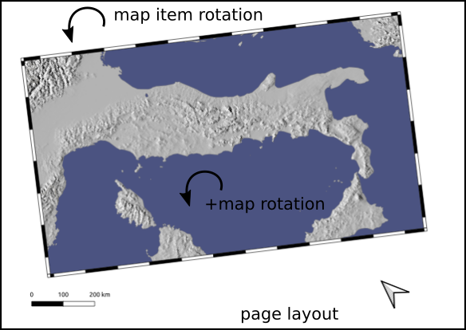
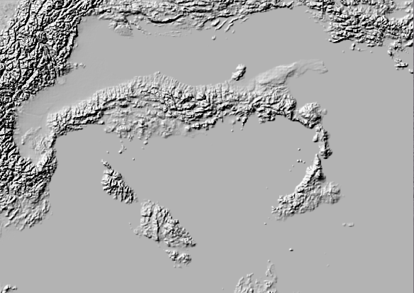
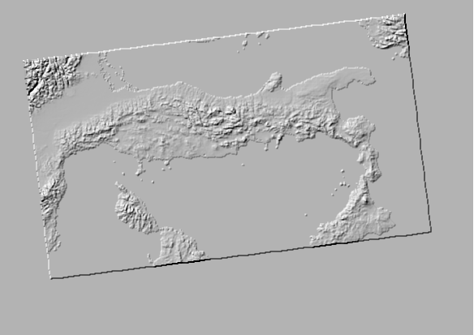

## Prepare a DEM for Blender, well aligned with a print layout

[version française](LISEZMOI.md)

Or how to cut, rotate a raster according to the extent of a print layout,
by extrapolating the extent of the map to the entire page (beyond the extent of the 'map' object),
taking into account rotations!

Allows you to obtain, for example, a DEM of the same proportion as an export of the same layout, well adjusted, for Blender.

Under Blender, the juxtaposition of the map image on the DEM is then facilitated.

Concerning the use of the QGis/Blender couple, go read the excellent article by Thomas Szczurek-Gayant there: https://geotribu.fr/articles/2024/2024-05-28_carte-relief-ombre-avec-blender-partie-1-preparation-donnes-avec-qgis-et-gdal/

**The layout** of which we wish to produce a 3D map under blender.



**The DEM product**



**or a 'embossed' version at sea level and map borders**



## The code

It's all there, a little commented, to run in the Python console : [resources/script.py](resources/script.py)

At the end of the script, the bits of code to uncomment.

The skimage library is required (https://scikit-image.org/docs/stable/user_guide/install.html)

```bash
python -m pip install -U scikit-image
```
