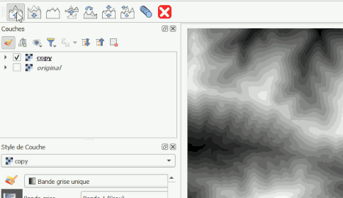

## A toolbar for editing digital elevation models (raster) using a brush
 
[french version](LISEZMOI.md) - [top](../README.md)
 
This is not a plugin!

 
## Usage

Copy script.py and the SVG files (button icons) to a folder of your choice. 
 
Open the script and run it in the QGIS Python console with a raster layer selected. A toolbar will appear, allowing you to manipulate the raster (raise, lower, blur, copy, etc.). 
 
Best suited to DEMs, it works by modifying the pixel values of a single-band raster.
 
Only works on local files (not WMS etc.), of the TIFF or ASC type.
 
Warning: the source file will be altered: remember to work on a copy of your originals.
 
The brush: circular with blurred edges. Its size, opacity and blur can be adjusted using the shortcuts Ctrl+scroll wheel, Shift+scroll wheel, Ctrl+Shift+scroll wheel
 

 : Enhances the relief
 
 : Carve out the relief
 
 : blur the relief
 
 : Copy from a second raster
 
- First select the source raster
 
 : Copy within the same layer
 
- Ctrl+Click to set the origin of the copy
 
 : Flatten the relief
 
 : Enhances the relief
 
 : drags
 
 : Close the toolbar
 
Known issue:
 
Adjusting the brush settings sometimes doesn't work (the zoom function takes precedence)... moving the map slightly (scroll wheel click) fixes the problem.

## Files
 
- repo : [https://github.com/xcaeag/Qgis-tips](https://github.com/xcaeag/Qgis-tips)
- script : [resources/rasterRetouchScript.py](resources/rasterRetouchScript.py)
