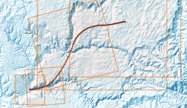
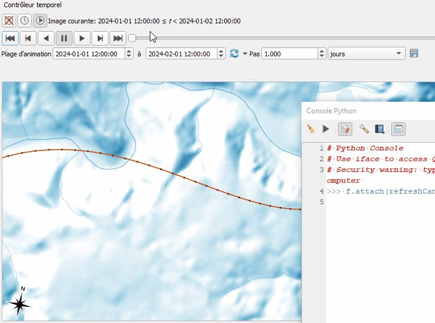

## Script pour un travelling

[english version](README.md) - [sommaire](../LISEZMOI.md)

En s'appuyant sur le controleur temporel, l'idée est de suivre un trajet de 'caméra' défini par une géométrie de type linestring. 

Emprise et orientation peuvent être portés par les valeurs M et Z de la géométrie.

Une fois 'connecté' (l'objet python) au controleur, ce bout de code va adapter la vue (et sauver la carte), selon la progression du curseur dans la plage de temps.

Prérequis :
- savoir exploiter la console python, 
- disposer d'un trajet (une couche de ligne), dont les noeuds vont définir les positions successives du centre de la vue, corrigées selon le nombre d'étapes du controleur temporel (de la date de départ à la date de fin, le trajet est parcouru dans son ensemble, les positions et valeurs M, Z seront interpolées).

**Exemple d'un trajet à suivre :**

Vous pouvez vous aider/inspirer de ce code https://xcaeag.github.io/Qgis-tips/bezier/README.html pour produire une courbe de bézier, ou la dessiner à main levée.

Mais manipuler les valeurs Z et M pour faire varier niveau de zoom et orientation demande un peu d'expérience de QGis et/ou dans l'utilisation de la boîte à outil de traitements.



**Un résultat (90 images)**


## Marche à suivre

1. Ouvrir et lancer le script `travellingScript.py` dans la console Python de QGis
2. Sélectionnez la couche 'trajet' à suivre
3. Ouvrir le controleur temporel et définissez la plage de temps, le pas (donnera le nombre d'images à produire)
4. Instanciez un objet Travelling (avec la couche sélectionnée, un chemin de sortie, un modèle de nom de fichier, les dimensions des images à produire)
    ```python
    flight_layer = iface.mapCanvas().currentLayer()
    cam = Travelling(
        flight_layer, 
        wdir=str(Path.home() / "tmp"), 
        filename="tmp-{:03d}.png", 
        w=640, h=480
    )
    ```
5. Connecter l'objet au controleur

    ```python
    cam.connectTemporalControler()
    ```

    Désormais, chaque modification de la position du curseur temporel entrainera un repositionnement de la vue, centrée sur un des noeud du trajet, et une image sera sauvée à l'emplacement défini à l'initialisation de l'objet.

    

6. Déconnecter l'objet du controleur

    ```python
    cam.disconnectTemporalControler()
    ```

## Produire un GIF ou une Vidéo

A partir des images produites, à l'aide de ffmpeg ou d'un outil de type screen2gif, vous pourrez gérérer GIF, mp4... 

Un exemple de commande ffmpeg : 

```shell
ffmpeg -start_number 0 -filter_complex "[0:v] fps=10,split [o1] [o2];[o1] palettegen [p]; [o2] fifo [o3];[o3] [p] paletteuse" -i ~/tmp/tmp-%03d.png  ~/tmp/animation.gif
```

## Le script

([resources/travellingScript.py](resources/travellingScript.py))

A vous de le modifier à votre idée, sauver le canevas plutôt qu'utiliser QgsMapRendererParallelJob ou autre améliorations... ou d'en faire un plugin !

