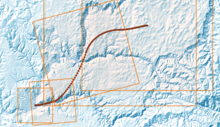

## Script for a tracking shot

[french version](LISEZMOI.md) - [top](../README.md)

Using the temporal controller, the idea is to follow a 'camera' path defined by a linestring geometry.

Extent and orientation can be carried by the M and Z values ​​of the geometry.

Once 'connected' (the python object) to the controller, this piece of code will adapt the view (and save the map), according to the progress of the cursor in the temporal range.

Prerequisites:
- know how to use the Python console,
- have a path (a line layer), whose position of the nodes will define the successive positions of the center of the view, corrected according to the number of steps of the time controller (from the start date to the end date, the path is traveled as a whole, the positions and values ​​M, Z will be interpolated).

**Example of a path to follow:**

You can help/inspire this code https://xcaeag.github.io/Qgis-tips/bezier/README.html to produce a bézier curve, or draw it freehand.

But manipulating the Z and M values ​​to vary zoom level and orientation requires a little experience with QGis and/or in using the processing toolbox.



**A result (90 images)**


## How to

1. Open and run the `travellingScript.py` script in the QGis Python console
2. Select the 'path' layer to follow
3. Open the time controller and set the temporal range, step (will give the number of frames to produce)
4. Instantiate a Travelling object (with the selected layer, an output path, a filename template, the dimensions of the images to produce)
    ```python
    flight_layer = iface.mapCanvas().currentLayer()
    cam = Travelling(
        flight_layer, 
        wdir=str(Path.home() / "tmp"), 
        filename="tmp-{:03d}.png", 
        w=640, h=480
    )
    ```
5. Connect the object to the controller

    ```python
    cam.connectTemporalControler()
    ```

    From now on, each modification of the position of the time cursor will result in a repositioning of the view, centered on one of the nodes of the path, and an image will be saved at the location defined when the object was initialized.

    

6. Disconnect the object from the controller

    ```python
    cam.disconnectTemporalControler()
    ```

## Produce a GIF or Video

From the images produced, using ffmpeg or a screen2gif type tool, you can build GIF, mp4...

An example of an ffmpeg command:

```shell
ffmpeg -start_number 0 -filter_complex "[0:v] fps=10,split [o1] [o2];[o1] palettegen [p]; [o2] fifo [o3];[o3] [p] paletteuse" -i ~/tmp/tmp-%03d.png  ~/tmp/animation.gif
```

## The script

([resources/travellingScript.py](resources/travellingScript.py))


All that remains is to make it a plugin !
