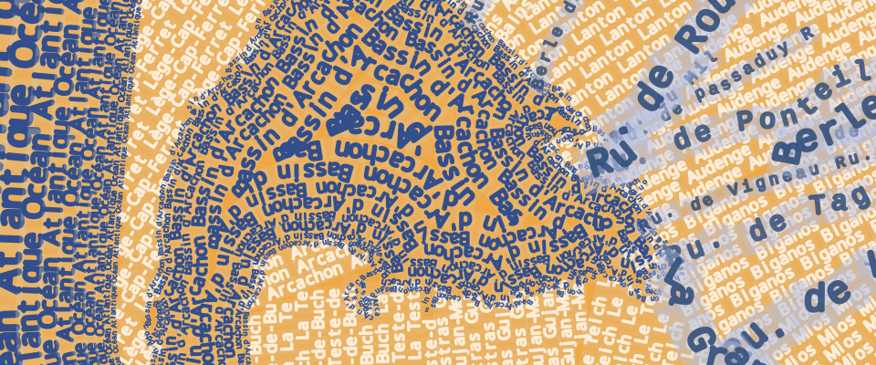
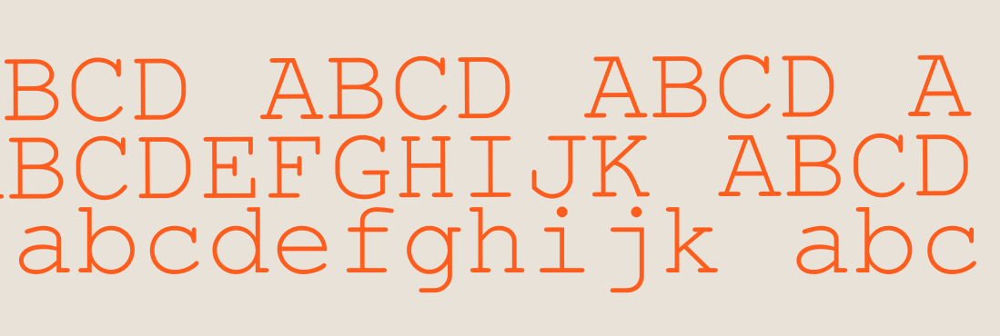

## Expressions for forced labelling... and animated

[french version](LISEZMOI.md) - [summary](../README.md)

If you are unable to label (in curved mode) a linear object along its entire length, and before this becomes possible natively, 
here is an expression that will allow you to label
regardless of the radius of curvature and repeat the text infinitely.



The principle:

- use the ‘symbol line’ style, with interval.
- as symbol: a font symbol
- as character: the expression “charloop()” which will display the characters of your text

In the function parameters: the text to be labelled, the layer ID (for technical reasons).

All that remains is to adjust the size, spacing, etc.


```python
# Examples:
# static text
charloop( “ABCDE...”, @layer_id)
# or a field from your layer
charloop( "toponym"||' ', @layer_id)
```
**How does it work?**

The QGis labelling engine scans the line to place each graphic element at regular intervals and, by chance, 
requests the expression at each location, 
the expression then simply distributes the characters one by one.

It handles any ordering issues (the rendering engine switches from one entity to another, from one layer to another, and complicates things).

A dictionary (python) stores the index of the character currently displayed for each entity.


## Expressions

In your profile folder, under python/expressions, place this script (or go through the ‘function editor’ interface and copy the content into your new script):

- [“resources/expressions/typograph.py”](resources/expressions/typograph.py)

## Animated version


The functions *animated_charloop()*, *charloop_shift* (for a subtle shift of characters), 
combined with the use of the “time manager”, and the text flows!

- The speed of progression will depend on the length of the text: 
  at the end of the cycle, the text returns to its initial position (the animation is infinite!).
- The direction of progression follows the direction of your lines




**Procedure**

- Activate 'time manager' for the layer
- Configuration: ‘redraw only’
- In the time manager, choose a period (in days, for example) 
  that corresponds to the number of images expected
- Use the expression (for the font symbol character) as follows: 

```python
animated_charloop('ABCDE', @layerid, @frame_number, @total_frame_count)
```

where @frame_number is a native variable (the index of the current step of the time manager) and @total_frame_count is the total number of steps (native variable or to be defined in the project properties in versions < 3.40)

However, this produces an animation that is too jerky (the function simply shifts the text by one character).

We can refine the positioning using an expression on the ‘shift along the line’ parameter:

```python
charloop_shift('ABCDE', @typo_gap, @frame_number, @total_frame_count)
```

where *@typo_gap* corresponds to the value of the interval chosen for your 
symbol line (variable to be defined or replaced by a numerical value)

## Additional functions

- **charloop_random**: like *charloop*, but with random offset (to avoid unfortunate text alignments)
- **animated_charloop_random**: animated version
- **line_direction_we**: determines whether a line is oriented west-east or east-west

## Problems/difficulties

- Text upside down, linear west-east, east-west? The direction in which the line is entered is important. The text moves forward in its direction. If you cannot control this at the source, you can change it using a “Geometry Generator” style, which may contain:

```python
case when line_direction_we()
	then ($geometry)
    else reverse($geometry)
end
```

- Bug detected: the animation will not work properly if only one entity is visible!

## Files

The script to be placed in your profile folder, under python/expressions

- [resources/expressions/typograph.py](resources/expressions/typograph.py)

An example project and its layers:

- [resources/demo.qgs](resources/demo.qgs)
- [resources/layers.gpkg](resources/layers.gpkg)
