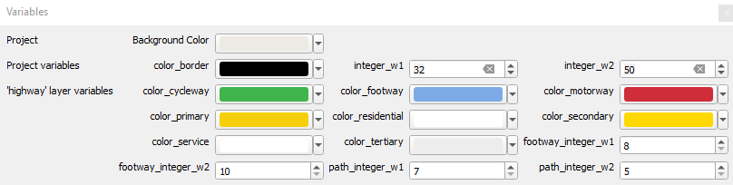
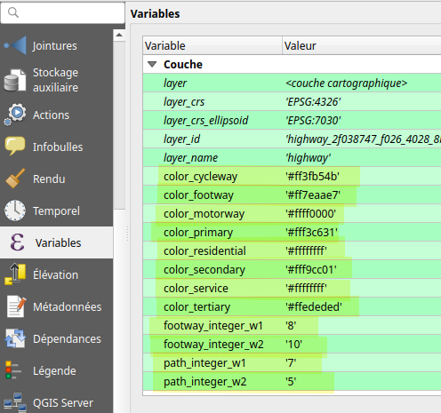
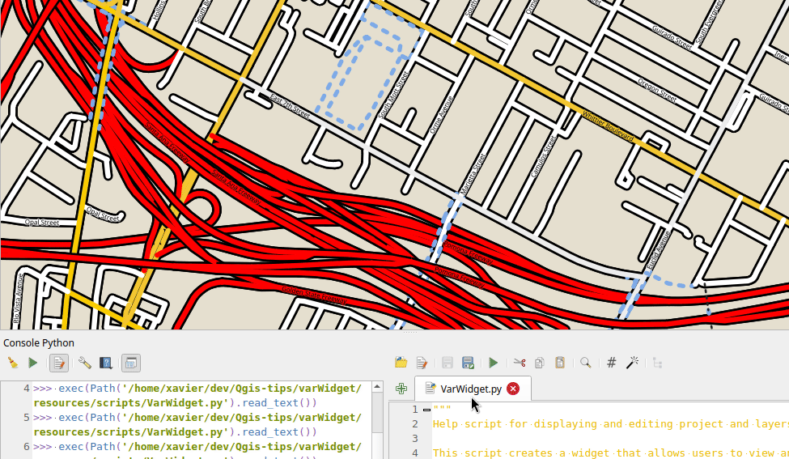

## Un dock pour ajuster les variables

[english version](README.md) - [sommaire](../LISEZMOI.md)

Gourmand dans l'utilisation de variables, je trouve leur exploitation un peu pénible quand elles sont éparpillées (variables de projet, variables de couche). 

Ce petit script (cf. console python) construit une mini interface qui permet de les ajuster toutes au même endroit. Ainsi, tous les styles basés sur une expression contenant une variable (par exemple la couleur = @color_border) seront actualisés plus facilement. 

En fin de script, le dictionnaire 'conf' vous permettra de typer vos variables (et d'ajouter des bornes aux numériques) et de proposer l'outil de saisie adéquat (spin box, color button). 

Sans cette configuration, le nom de la variable peut suffire : si contient 'color', un outil de choix de couleur est proposé, 'integer' pour un entier, 'double' ou 'real' pour un nombre réel.

En plus des variables, la couleur de fond (du projet) est ajustable.

Exemple de widget :\

Exemple de variables de couche :\

Démo :\

## Le script

- ['resources/scripts/VarWidget.py'](resources/scripts/VarWidget.py)

