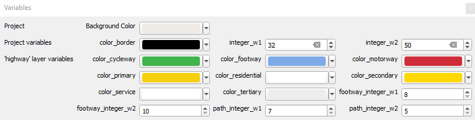
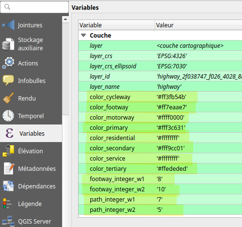
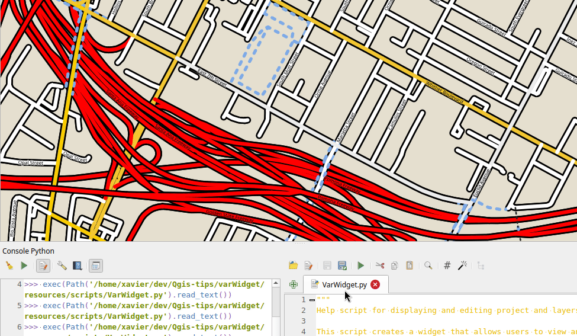

## A dock for adjusting variables

[french version](LISEZMOI.md) - [top](../README.md)

I'm very fond of using variables, but I find them a bit difficult to use when they're scattered (project variables, layer variables).

This little script (cf. python console) builds a mini interface that lets you adjust them all in the same place. In this way, all styles based on an expression containing a variable (for example colour = @color_border) will be updated more easily.

At the end of the script, the “conf” dictionary will allow you to type your variables (and add bounds to the numeric values) and provide the appropriate input tool (spin box, color button).

Without this configuration, the name of the variable may suffice: if it contains “color”, a colour selection tool is proposed, “integer” for an integer spin box, “double” or “real” for a real number.

In addition to the variables, the background colour (of the project) can be adjusted.

Widget example :\

Layer variables example :\

Demo :\

## Le script

under /resources

- ['VarWidget.py'](resources/VarWidget.py)